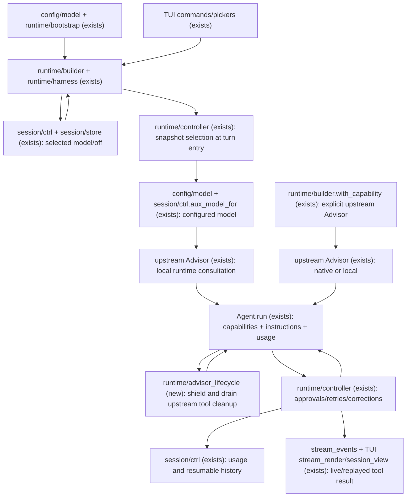

# Full migration to upstream Advisor

**Date:** 2026-09-16
**Status:** Approved by user “go on” on 2026-09-16; checks derived before implementation.
**Workflow:** tlc-spec-lean. Profile: light (project default).
**Baseline inspected:** `1eb9a8e6c26b1a68cb26d4a8ec54df065440512c`, branch
`work/upstream-workflows`. Reconcile against the implementation branch before building.

## Approved port adjustment

On 2026-09-16 the user approved adapting this advisor-only feature to current
master `fb558301d2def1f3c90011dbeec0ec262c6ec888`, preserving its already-base
`pydantic-ai-harness==0.31.0` and core `>=2.43,<3` dependencies. AC26/C26's
metadata literal and the installed-wheel proof now target that pin and package
0.11.0. All other 30 obligations remain unchanged. Prior validation belongs to
the original feature branch; verification of the transplanted tree is pending.
Existing workflow, compaction, output-limits and server migrations remain intact.

## Sources

- Conversation: “can we replace the advisor feature to the upstream version?”,
  “it works with any model”, “plan full migration”, “use tlc skills” — scope is
  both the runtime feature and the exported SDK capability; this turn produces a plan.
- `AGENTS.md`, “Prefer upstream capabilities” — remove owned runtime machinery,
  accept reasonable upstream behavior differences, preserve permissions and resumability.
- Existing `src/marim_harness/advisor.py`, `capabilities/advisor.py`,
  `tools/advisor_tools.py`, `runtime/{harness,controller,builder,instructions,deps}.py`,
  `session/ctrl.py`, and advisor tests — current contracts and construction path.
- `docs/embedding.md`, `docs/sdk/capabilities.md`, `docs/reference/configuration.md`,
  `docs/guides/tui.md` — externally documented behavior to migrate.
- [Upstream Advisor](https://pydantic.dev/docs/ai/harness/advisor/) and installed
  `pydantic_ai_harness/advisor/_capability.py` in Harness 0.31.0 — consultation behavior.
- [Pydantic AI capabilities](https://pydantic.dev/docs/ai/capabilities/overview/) and
  installed core 2.43.0 `Agent.run`/`Agent.iter` — public per-run capability composition.
- `.specs/STATE.md` AD-001 — preserve CLI lifecycle event and mirror-history boundaries.
  No confirmed project lessons were present when planning.

### Release and feasibility evidence

The original planning tree declared core `>=2.43.0,<3` and Harness `>=0.31.0,<0.32`,
the latter under the workflows extra and development dependencies. Both selected
versions were installed; that base runtime did not yet require Harness. The
approved port retains master's already-base exact pin (see adjustment above).

An offline Python 3.12.3 probe using these installed releases passed on 2026-09-16:

- A single `Agent` offered Advisor on one run and omitted it on the next by changing
  the public `capabilities=` argument. No agent reconstruction was needed.
- `max_uses=1` allowed one consultation in each of two executor responses in one run.
- Three executor requests and two advisor requests accumulated exactly five requests,
  47 input tokens, and 21 output tokens in the shared `RunUsage`.
- `forward_history=True` excluded the current unresolved advisor call, and the child
  agent received no function tools.
- A shared request limit of one blocked the nested request; a provider exception
  propagated; `max_tokens=512` was rejected.

Probe source for this session:
`/tmp/marim-1000/marim-harness-309990f67170/20260916-213829-4a7aee/scratchpad/advisor_migration_probe.py`.
This establishes upstream API feasibility, not Marim integration, live-provider
compatibility, or Python 3.10/3.14 acceptance. Durable regression proofs belong in
the subsequent `checks.md`, not in this temporary probe.

## Problem

Marim owns two advisor entry points and their consultation plumbing: transcript
flattening and clipping, a nested agent, retry and error conversion, per-turn
counters, usage trailers, tool registration, and a portable capability wrapper.
Maintainers must keep these behaviors aligned with each other and with the evolving
agent runtime. Advisor tokens currently appear in advice text without participating
in the parent run's normal usage budget. No maintenance-time measurement or incident
count was supplied; this is an ownership reduction, not a measured performance claim.

After migration, upstream Advisor executes every consultation. Users keep model
selection, session persistence, the picker, and the builder entry point. Model-native
advisor support is not required for portable local consultation; the executor must
be able to call tools, and the advisor must be usable as a text model.

## Out of scope

| Excluded | Why |
| --- | --- |
| Compaction, subagent, workflow, approval-loop or session-store replacement | Independent migrations; this changes only advisor integration |
| Making Claude/Codex main backends call Marim tools | External CLIs own their loops; using them as auxiliary advisors remains in scope |
| New daemon advisor mutation endpoint or Android settings screen | Existing remote read/replay continues; remote `/advisor` remains unavailable |
| Durable execution integration | Marim does not use an upstream durable backend; upstream local Advisor has documented durability limits |
| Per-advisor billing ledger schema or historical usage backfill | Keep existing aggregate turn reporting; do not invent per-model data the shared accumulator lacks |
| Preserving no-argument calls, clipping retries, and errors-as-advice text | These are the custom consultation semantics being retired |
| Permanent old/new engine switch | Rollback uses source control; production retains one consultation engine |

## Assumptions

| Assumption | Chosen default | Rationale | Confirmed? |
| --- | --- | --- | --- |
| Runtime provider routing | Resolve through Marim's model source and pass a concrete model into upstream Advisor; use upstream local execution | Preserves credentials, base URLs, provider settings, cost capture, and CLI clone behavior; strings in upstream fallback bypass Marim's resolver | n |
| Native execution exposure | Keep native/auto selection available through `with_capability(pydantic_ai_harness.Advisor(...))`; do not add a second native selector to Marim | Model objects intentionally select local execution upstream; callers choosing upstream strings accept its provider resolution | n |
| Timing of `/advisor` changes | Persist immediately, apply on the next Marim turn | Public run capabilities avoid a rebuild; one turn keeps a stable choice across approval and correction rounds | n |
| Advisor context | Use upstream `forward_history=True` for the runtime helper, and require a self-contained consultation prompt | Keeps completed conversation context without custom serialization; current partial response is excluded upstream | n |
| Call cap | Adopt upstream per-model-request scope, keeping `max_uses` and `MARIM_ADVISOR_MAX_USES` with explicit migration documentation | Preserving a per-turn cap would retain custom budget machinery; overall turn usage limits remain independent | n |
| Failure policy | Adopt upstream retries and exception propagation | Keeps one error policy; existing Marim turn handling owns cleanup and resumability | n |
| SDK import compatibility | Keep direct upstream re-exports at the two existing import paths for one release | Import compatibility costs no second implementation; constructor and behavior changes are documented | n |
| Verification depth | Use profile `light`; run project-required lint, type, test and build checks during implementation | No project TLC profile overrides the default; no mutation-testing claim will be made at light profile | n |

The user approved proceeding with the presented plan on 2026-09-16. The table records
which choices originated as planning defaults; that approval accepts those defaults,
including configured routing through upstream local execution.

**Open questions:** none blocking the plan — product choices have explicit defaults
above and remain reviewable. Prefer native automatically is the live alternative
to the routing proposal; selecting it requires revisiting provider-resolution and
cost-reporting criteria before checks are frozen.

## Criteria

### S1: Portable advice through the upstream implementation (P1)

**Acceptance Criteria**

1. WHEN a configured advisor is called by a tool-capable main model THEN Marim SHALL execute the consultation through `pydantic_ai_harness.Advisor`.
2. WHEN the executor has no provider-native advisor support THEN the configured runtime advisor SHALL return advice through upstream local execution.
3. WHEN Marim resolves a runtime advisor THEN the consultation SHALL use the model produced by its configured model source, including its provider/client settings.
4. WHEN the runtime advisor receives `prompt` THEN it SHALL receive completed executor history through upstream `forward_history=True`, excluding the current response.
5. WHILE the runtime advisor is disabled and no explicit SDK Advisor is supplied the main agent SHALL advertise zero advisor tools and no advisor-specific instructions.
6. WHEN an external CLI model is used as the advisor THEN Marim SHALL run it through `aux_model_for` with a read-only ephemeral conversation distinct from the live user session.
7. WHILE an external CLI model is the main executor Marim SHALL omit its own runtime advisor capability from that turn.
8. WHEN an embedder supplies one upstream Advisor through `with_capability` with runtime advisor configuration disabled THEN the composed agent SHALL expose exactly one advisor, with native/local selection owned by upstream.
9. IF an embedder supplies an explicit upstream Advisor and enables Marim's runtime advisor for the same turn THEN Marim SHALL reject that conflicting composition before making a model request.

**Independent test:** run a deterministic executor and distinct advisor model through
the real builder/controller; inspect outgoing tools, child context, advice, and model
identity. Separately exercise an upstream native-capable mocked provider and a local
fallback through the SDK path. CLI tests use existing fake transports, not subscriptions.

### S2: Session selection with a stable turn boundary (P1)

**Acceptance Criteria**

10. WHEN a session is opened THEN the selected advisor SHALL resolve by saved model, explicit saved `off`, and finally config default, with `off` overriding that default.
11. WHEN `/advisor <model>` or `/advisor off` changes the selection during a turn THEN all remaining approval, retry and structured-output correction rounds of that turn SHALL retain its original advisor selection.
12. WHEN the next Marim turn starts after a selection change THEN it SHALL use the new selection without rebuilding the main Agent.
13. WHEN a selection is saved during a turn THEN Marim SHALL persist only session metadata without publishing unanswered tool calls.
14. WHEN `/advisor`, the picker, or the startup notice reports a selection THEN its copy SHALL state next-turn timing or CLI-executor unavailability where applicable.
15. WHEN historical sessions containing `advisor()` calls and usage trailers are loaded THEN Marim SHALL preserve their messages without rewriting the historical tool arguments or results.

**Independent test:** hold a turn at an approval barrier, switch or disable the advisor,
finish the turn, and start another. Check calls on both sides, persisted metadata,
unchanged Agent identity, JSON round trip, and historical transcript replay.

### S3: Upstream budgets and failure behavior (P1)

**Acceptance Criteria**

16. WHEN `max_uses=1` is configured and two advisor calls appear in one executor response THEN upstream Advisor SHALL start at most one consultation for that response.
17. WHEN a new executor response requests advice in the same turn THEN the upstream per-request consultation allowance SHALL reset.
18. WHEN consultation usage is reported THEN the parent turn and session SHALL include that usage exactly once through the shared run accumulator.
19. IF a nested consultation would exceed the remaining request allowance THEN it SHALL be prevented by the parent's `UsageLimits`.
20. WHEN a consultation fails or is cancelled after reporting usage THEN Marim SHALL bank the reported usage exactly once.
21. IF an advisor provider error ends a turn THEN Marim SHALL persist a resumable history with a return for every persisted ordinary tool call.
22. WHEN an active consultation is interrupted THEN Marim SHALL cancel or drain its work before releasing the session's existing ownership claim.
23. IF runtime `max_tokens` is below 1024 or SDK `max_uses` is non-positive THEN advisor configuration SHALL fail with a validation error before a provider request.
24. WHEN `MARIM_ADVISOR_MAX_USES` is unset or `0` THEN runtime configuration SHALL map it to upstream `None`.
25. WHEN one run aggregates executor and advisor costs THEN Marim SHALL label that aggregate as estimated or unavailable unless all charged contributions are known to be provider-billed amounts.

**Independent test:** use counted concurrent tool calls, fixed request/token usage,
injected provider failures and cancellation barriers across approval rounds. Check
the outcome, persisted tokens, clean continuation, limit enforcement, and cost flags.
Keep upstream normal retry behavior for malformed model output; do not reproduce
its private counter or retry algorithm in Marim.

### S4: One engine, migrated public contracts (P1)

**Acceptance Criteria**

26. WHEN Marim is installed without the workflows extra THEN its configured advisor SHALL import and run using base dependency `pydantic-ai-harness==0.31.0`.
27. WHEN either historical Advisor import path is used THEN it SHALL resolve to the upstream Advisor class itself, with no consultation wrapper.
28. The production advisor path SHALL contain no Marim consultation agent, clipping retry, per-turn advisor counter, usage trailer generator, or `services.advise` dispatch.
29. WHEN local advice completes THEN TUI live rendering and saved replay SHALL show its tool result outside collapsed ordinary tool groups.
30. WHEN configuration, SDK and TUI documentation describe advisor behavior THEN they SHALL document the prompt argument, per-request cap, 1024-token minimum, next-turn switching, propagated errors, routing distinction, and CLI-executor limitation.
31. WHEN advisor settings are edited THEN the settings form SHALL label the cap as calls per model request and reject output-token values below 1024.

**Independent test:** use a base-only installation smoke, import identity assertions,
source-reference removal checks, deterministic live/replay rendering, config validation,
and documentation reference checks. The implementation closes with ruff, pyright,
pytest and build, in that order; Python 3.10/3.12/3.14 results are recorded separately.

## Traceability

| ID | Slice | Criteria | Status |
| --- | --- | --- | --- |
| ADV-01 | S1 | 1, 2, 3, 4, 5 | Implemented |
| ADV-02 | S1 | 6, 7 | Implemented |
| ADV-03 | S1 | 8, 9 | Implemented |
| ADV-04 | S2 | 10, 11, 12, 13, 14, 15 | Implemented |
| ADV-05 | S3 | 16, 17, 18, 19, 20 | Implemented |
| ADV-06 | S3 | 21, 22, 23, 24, 25 | Implemented |
| ADV-07 | S4 | 26, 27, 28 | Implemented |
| ADV-08 | S4 | 29, 30, 31 | Implemented |

## Observable

| Surface | Decision | Landing |
| --- | --- | --- |
| TUI advisor picker/settings | Empty and unavailable state | AC 5, 7, 14; existing picker has no-model/source-unavailable feedback |
| TUI advisor picker/settings | Loading and errors | Existing catalog loading/error widgets; AC 23, 31 for new bounds |
| TUI advisor picker/settings | Unauthorized state | Existing provider/catalog credential errors; no new authorization UI |
| TUI advisor picker/settings | Density and ordering | Existing settings rows and model picker ordering |
| TUI advisor picker/settings | Destructive confirmation | n/a - selecting a model does not delete conversation data |
| TUI transcript | Consultation pending, result, failed/cancelled | Existing tool pending/error presentation; AC 20, 21, 22, 29 |
| `/advisor` | Arguments, defaults, output and timing | AC 10, 11, 12, 14; bare command opens existing picker |
| `/advisor` | Partial failure and exit status | Existing command error reporting; TUI commands have no separate process exit code |
| Headless turns | Output and failure | Existing TurnOutcome/CLI exit mapping; AC 18, 20, 21, 25 |
| SDK builder and capability | Result/error shape and versioning | AC 8, 9, 23, 27, 30; documented behavior migration within current pre-1.0 package |
| SDK builder and capability | Caller authorization and throttling | Existing configured-model consent; AC 16, 17, 19; no new actor or permission |
| Daemon session metadata | Read shape and permissions | Existing `advisor_model` field and authenticated session reads; selected value is the next-turn setting |
| Attached TUI | Advisor mutations | Existing require-local rejection; no new remote command |
| Documentation | Structure, tone, next action | AC 30; retain reference pages and add concise migration guidance |
| Advisor capability collection | Grouping, name, duplicates, exceptions | AC 5, 8, 9; exactly one logical advisor; unavailable on CLI executor |

The nine system dimensions were walked during planning. Their proof mappings will
be recorded once, under `Swept` in the later `checks.md`: bounds (23–24, 31),
failure/partial failure (20–22), retry/duplicates (8–9, 11, 18), authorization/limits
(6–7, 16, 19), concurrency/order (11–12, 16, 22), lifecycle (10, 13, 15), external
failure (21, 23), state transitions (5, 10–14), and observability (18, 20, 25, 29–30).
No TTL, data backfill, rate-limit service, or new permission system is implied.

## Flow

Reuse upstream Advisor for tool schema, child execution, native/local policy, caps,
and shared usage. Reuse Marim's model source, auxiliary CLI isolation, approval
controller, history repair, session persistence and UI. The per-turn capability
argument removes the need to rebuild the Agent or mutate its private registrations.

Take the model selection snapshot before the first await of the Marim turn, then
resolve/create its capability inside the existing protected turn path. Pass the
same choice and advisor guidance into every `Agent.run`, including the dictionary
output correction path. Mid-turn setter calls update persisted selection only.
Keep short guidance about when to consult and including current evidence; remove
the claim that the advisor automatically sees the whole in-flight transcript.

Do not eagerly construct clients for an unconfigured advisor. Resolve bare and
qualified runtime IDs through the existing source; a builder without a source uses
Pydantic AI inference. External CLI auxiliary instances keep existing close/ownership
behavior; do not reuse the live CLI conversation or leak clones on turn completion.

Keep model-based native selection inside upstream for the explicit SDK path. An
SDK caller passing a custom Model retains its configuration through local execution.
A caller passing an upstream model string accepts upstream resolution and native
provider configuration. Custom Marim provider names are not upstream model strings.

Usage follows the existing per-round accumulator and banking path. Do not add the
child usage a second time or persist the child's history into the main transcript.
Cross-model cost is a required integration audit: `RunUsage.cost` is best-effort,
and Marim's legacy billed-cost detail can cover only some requests in a mixed run.
Prefer available upstream per-request pricing totals for estimates; do not price
all nested tokens at the executor rate or label a partial billed sum as exact.
Unknown coverage is displayed as estimated/partial or unavailable, with no ledger
schema change. The ledger's model label continues to identify the executor of the turn.

The public `wrap_tool_execute` integration shields the upstream advisor handler,
cancels it once, and drains cleanup through the existing `drain_task` boundary
before the turn releases ownership. It owns no consultation logic. The existing
usage details bag stores aggregate estimate/unknown markers so session reload
does not mistake a partial billed amount for an exact mixed-model total.

## Relations

None - no stored-data shape change. Sessions retain their selected advisor and
existing message records. An active turn holds a transient selection snapshot;
it is not a new persisted entity. Historical advisor exchanges are immutable input.

## Surface

None - no HTTP routes are added or changed. The changed non-HTTP signatures and
outcomes are enumerated here; HTTP status codes do not apply to these interfaces.

- `HarnessBuilder.with_advisor(model, *, max_tokens=2048, max_uses=None)`:
  returns the builder; model-source routing and next-turn selection; `max_uses`
  now means per executor request; invalid bounds raise configuration errors.
- `Harness.set_advisor_model(model_id_or_none, *, persist=True)`:
  stores the next-turn selection; returns `None`; existing persistence errors
  remain errors; it does not cancel an in-flight consultation.
- `/advisor [model|off]`: bare opens picker; selection/off returns a next-turn
  confirmation; unavailable source/catalog/remote-host cases use existing messages.
- `MARIM_ADVISOR_MODEL`, `MARIM_ADVISOR_MAX_TOKENS=2048`,
  `MARIM_ADVISOR_MAX_USES=0`: keep names; tokens require at least 1024;
  uses `0` means unlimited, positive integers mean per-request allowance.
- Model-facing local `advisor(prompt: str) -> str`: advice or upstream limit
  response; invalid model output enters upstream retry handling; provider and
  usage-limit failures propagate to normal Marim turn handling.
- `marim_harness.capabilities.Advisor` and
  `marim_harness.capabilities.advisor.Advisor`: deprecated direct aliases to
  `pydantic_ai_harness.Advisor` for one release. Supported options/defaults become
  upstream `mode='auto'`, `max_uses=None`, `max_tokens=None`, `caching=None`,
  `forward_history=False`; former `id`, `description`, and `defer_loading` arguments
  receive normal constructor errors. Runtime helper defaults remain as above.
- Persisted/daemon `advisor_model`: same model/`off`/unset storage and existing
  normalized read shape; identifies selected configuration, which may differ from
  the current turn's snapshot. No active-advisor field is added.

## Landing

| One-way door | Literal shape | Alternative rejected |
| --- | --- | --- |
| 1: Required upstream runtime | Base dependency `pydantic-ai-harness==0.31.0`, core `>=2.43,<3` | Keeping Harness workflows-only would make a previously base feature depend on installing an unrelated extra |
| 2: Public consultation contract | `advisor(prompt: str)`; runtime uses `Advisor(resolved_model, mode='local', forward_history=True)` | No-argument transcript wrapper preserves a custom tool and serialization responsibility |
| 3: Model routing | Runtime helper resolves a concrete configured model; SDK exposes upstream string-based native/auto execution | Automatically converting configured models to strings loses custom client/fallback routing; copying native selection would create a second engine |
| 4: Switch boundary | Snapshot `advisor_model_id` at Marim turn entry; setter affects next turn | Per-consultation switching requires custom dispatch; whole-Agent reconstruction is unnecessary |
| 5: Budget/error semantics | Per-request `max_uses`; minimum `max_tokens=1024`; provider exceptions propagate | Reproducing per-turn counters, clipping retries and failure strings keeps superseded runtime logic |
| 6: SDK migration | `Advisor` is a direct upstream alias for one release; all examples switch to upstream import | Retaining a behavior-compatible wrapper would keep two contracts alive indefinitely |

Dependency door 1 also affects other upstream migrations. It is recorded in
`.specs/STATE.md` without replacing the unrelated CLI lifecycle handoff. The port
retains the dependency boundary already established on current master.

## Impact

| Front | What changes |
| --- | --- |
| domain: advisor call | No-argument transcript review becomes a prompt-bearing upstream consultation; guidance, schema examples and replay assumptions must reflect that |
| domain: max uses | Per-turn cap becomes per-model-request cap; config docs, builder docs, settings labels and cap tests consume this term |
| domain: live selection | Next consultation becomes next Marim turn; commands, picker notices, startup display and session metadata readers consume it |
| domain: advisor failure | Advisory error text becomes normal run failure/retry behavior; headless/TUI outcome reporting and history repair are exercised |
| domain: usage | Nested requests/tokens enter aggregate turn usage; cost reporting must distinguish aggregate estimates from partial billed data |
| stored data | No rewrite, backfill, new entity or session version; keep old call/result and usage-trailer replay |
| dependency footprint | Retain master's existing base Harness dependency and exact pin; dynamic-workflow/Monty remain optional extras; verify a base-only wheel install and lazy CLI imports |
| code removed | Remove `consult`, `make_advisor`, `_advise_prompt`, clipping attempts, advisor tool registration/prepare hook, `AdviseFn`, `services.advise`, `Deps.advisor_uses`, `Deps.advisor_max_uses`, and their reset path; reduce exported capability modules to aliases |
| code retained | Session `off` semantics, public setter/builder, environment parsing, model-source resolution, CLI isolation and short consultation guidance are integration, not a parallel advisor engine |
| shared helpers | Keep `render_transcript` and binary-safe rendering for their non-advisor consumers; preserve master's already-landed upstream compaction and output-limit integrations |
| tests | Replace tests asserting retired custom semantics only after approved checks describe the new contract; retain session/permission/resume evidence; add capability composition, CLI isolation, limits, cancellation and mixed-cost cases |
| documentation | Update `.env.example`, advisor config/SDK/TUI/session guidance, changelog and advisor architecture paragraph in `AGENTS.md`; preserve unrelated current edits and historical designs |

## Review and verification path

The user approved this full migration scope on 2026-09-16. TLC Plan produced
this artifact first; after review, derive `checks.md` with one observable claim and
executable proof per check, status/option coverage sets, the nine-dimension sweep,
and the profile pin. Then build the four outcome slices, remove the old engine,
and dispatch an independent Verifier over the complete feature diff. Implementation
status and proof evidence are tracked in `checks.md` and `verification.md`.

Implementation acceptance includes `uv run ruff check src tests`, `uv run pyright`,
`uv run pytest`, and `uv build` in that order, plus the repository Python-version
CI matrix and base-install smoke. Paid-provider/CLI subscription tests are not
implied by this planning request; deterministic fake-provider tests settle the
contract, and any live smoke is reported separately from those results.

Rollback uses source-control reverts rather than an engine toggle. Read completed
new `advisor(prompt)` exchanges as ordinary tool history after rollback; do not
rewrite saved transcripts to restore the historical no-argument schema. The port
builder performs no push, merge, deployment, or modification of unrelated plans.
The user subsequently authorized the orchestrator to open and babysit a PR after
the advisor-only adaptation and fresh verification; merging is not authorized here.
