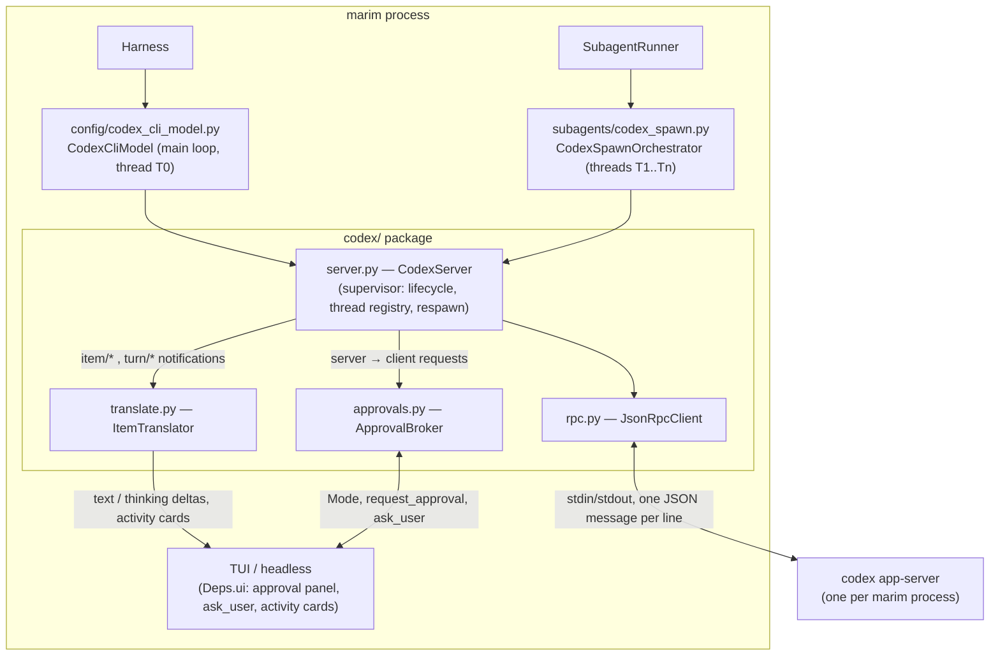

# Codex CLI as a provider and a sub-agent backend — Design

Date: 2026-09-04
Branch: `feat/codex-cli-backend` (off master at bdc75095, v0.6.0)
Status: approved 2026-09-04 (reviewed on mddocs) — implementation pending

## Goal

Let marim drive OpenAI Codex the same two ways it drives Claude Code today:

1. **Main-loop provider** — `MARIM_PROVIDER=codex-cli` (model slugs
   `codex-cli:gpt-5.6-sol` etc.) so a whole session runs on a ChatGPT
   subscription through the `codex` binary, with marim's transcript, session
   persistence, TUI cards, approval panel, steer and Ctrl-C all working.
2. **Sub-agent backend** — `backend: codex-cli` in an agent spec's
   frontmatter, so a spawn runs inside Codex while the parent stays on any
   provider; the spawn renders as a first-class card in the sub-agents screen
   and resumes after an interruption.

Unlike the `claude-cli` pair, this one keeps **marim's approval gating in the
loop**: Codex asks marim before running commands or applying patches, and
marim answers from its live `Mode` (`auto`/`ask`/`plan`) and its existing
approval panel. That is the headline difference and the reason for the
transport chosen below.

## Background

### What exists: the `claude-cli` pair

marim's "backend for Claude" is two layers sharing a kit:

- `config/claude_cli_model.py` — `ClaudeCliModel(Model)`: a Pydantic AI model
  adapter that shells out to `claude -p --output-format stream-json`, folds the
  stream into a **text-only** `ModelResponse` (tool activity goes to the TUI on
  side channels via `Deps.ui.on_cli_activity`, never into marim's history as
  tool parts), and demuxes Claude's own Agent/Task sub-agents into cards.
  `Harness.wire_cli_model` late-binds `mode_getter`, `cwd`, `on_activity`,
  `on_subagent`, `on_subagent_model` onto it from `bind_ui`/`set_model`/bootstrap.
- `subagents/cli_backend.py` + `cli_spawn.py` + `cli_demux.py` — the spawn
  side: `build_cli_argv`, `CliStreamTranslator`, `ClaudeCliRunner`, and
  `CliSpawnOrchestrator.execute/resume` producing the backend-agnostic
  `SpawnRun` (`subagents/backend.py`) that `SubagentRunner`'s single lifecycle
  finalizes.

The 2026-06-29 provider spec accepted that under `claude-cli` marim's tools,
approval, LSP and MCP **do not apply**: `claude -p` is one-shot, it cannot ask
marim anything mid-run, so permission is set up front via `--permission-mode`.

### What Codex offers (verified live against codex 0.152.1)

Three surfaces were probed on this machine:

| Surface | Shape | Verdict |
|---|---|---|
| `codex exec --json` | one-shot JSONL, **item-level** only (no text deltas), `codex exec resume <thread_id>` for continuation | works, but cannot talk back — same ceiling as `claude -p` |
| `codex app-server` | long-lived stdio **JSON-RPC 2.0** (v2 schema; the `jsonrpc` key is omitted on the wire), streams deltas, brokers approvals as server→client requests, threads resumable by id | chosen |
| `codex mcp-server` | MCP tools `codex` / `codex-reply` | thin; no approvals, no deltas |

The v1+v2 protocol schema was dumped with
`codex app-server generate-json-schema --out DIR` and is the source for every
method/notification name below. Live `model/list` returned `gpt-5.6-sol`
(default), `gpt-5.6-terra`, `gpt-5.6-luna`, `gpt-5.5`, `gpt-5.4-mini`,
`gpt-5.3-codex-spark`, each with reasoning efforts among
`low/medium/high/xhigh/max` (`ultra` on some).

Two leaks seen in the probes shape the isolation section: a bare `thread/start`
booted all five of the user's global MCP servers, and a trivial `exec` turn read
the user's `superpowers` plugin first and cost ~83k input tokens.

### Why app-server (approach B) over exec (A)

`exec` would be a near copy of the Claude backend and inherit its ceiling: no
mid-run approvals, no streaming text, no steer. app-server costs a JSON-RPC
client and a process supervisor (two small modules) and buys everything marim
is missing on the Claude side: real approval brokering, `ask_user`, steer,
interrupt, deltas, model catalog, and true thread resume. The client and
supervisor are generic enough to be reused if Claude Code's own bidirectional
mode (`--input-format stream-json --permission-prompts host`) is adopted
later (filed as a Gitea follow-up).

## Architecture

One `codex app-server` process per marim process, started lazily on first
use, hosting one Codex **thread per marim session or spawn**. Threads are
independent conversations; turns on different threads run concurrently, so the
main loop and background spawns share the process.

### New package: `src/marim_harness/codex/`

| Module | Responsibility | Depends on |
|---|---|---|
| `rpc.py` | `JsonRpcClient`: framing (newline-delimited JSON, tolerate a missing `jsonrpc` key), outbound `request()` with futures keyed by id, outbound `notify()`, inbound dispatch to a notification handler and a **server-request** handler (server→client calls carry an id and expect a response). Pure protocol; no Codex knowledge. | asyncio |
| `server.py` | `CodexServer`: process lifecycle (spawn `codex app-server`, `initialize`/`initialized` handshake with `clientInfo={name:"marim-harness",version}`, min-version check from `initialize.userAgent`), thread registry (`start_thread`, `resume_thread`, per-thread event queues), crash detection and lazy respawn, `kill()` via process group. Routes every inbound message by `threadId` to that thread's `ThreadHandle`. | `rpc.py`, `cli_backend._kill_process_group` |
| `translate.py` | `ItemTranslator`: pure functions mapping `item/*` and `turn/*` notifications to marim-side events (see table). Table-driven, unit-tested from captured fixtures. | nothing |
| `approvals.py` | `ApprovalBroker`: answers `item/commandExecution/requestApproval`, `item/fileChange/requestApproval`, `item/permissions/requestApproval`, `item/tool/requestUserInput`, `mcpServer/elicitation/request` from marim's `Mode`, the approval callback and `ask_user`. Pure at the decision layer (`decide(mode, request, workspace_root, scratchpad) -> Decision`) with the callback wiring around it. | `runtime/permissions.Mode` |
| `catalog.py` | `model/list` → marim's model catalog entries; `account/rateLimits/read` for the status line (best effort). | `server.py` |
| `env.py` | env keys (`MARIM_CODEX_CLI_BIN`, `MARIM_CODEX_CLI_TIMEOUT`), `resolve_codex_binary`, `codex_available` (binary on PATH and `$CODEX_HOME/auth.json` present), `CodexUnavailable`. | nothing |

The two front doors stay where their Claude twins live so provider/backend
discovery keeps one shape:

- `config/codex_cli_model.py` — `CodexCliModel(Model)`.
- `subagents/codex_spawn.py` — `CodexSpawnOrchestrator`.

### Notification → marim event table

| Codex notification / item | marim side |
|---|---|
| `item/agentMessage/delta`, `agentMessage` item | `TextPart` start/delta events on the streamed response |
| `item/reasoning/textDelta`, `reasoning` item | `ThinkingPart` start/delta events |
| `commandExecution` item (started → outputDelta → completed) | `bash` activity card: command, cwd, streamed output, exit code |
| `fileChange` item | `edit_file` activity card: per-path change summary |
| `mcpToolCall`, `webSearch` items | generic tool activity card |
| `collabAgentToolCall`, `subAgentActivity` items | activity card on the same transcript (no nesting in v1) |
| `plan`, `userMessage` items | ignored (marim already holds the user message; plans are out of scope) |
| `thread/tokenUsage/updated` | `RequestUsage` for the turn (last value wins) |
| `turn/completed` | closes the stream; `status` decides success / interrupted / failed |
| `error`, `warning` | turn failure / notice (see error handling) |

Activity cards flow through `Deps.ui.on_cli_activity` exactly as the Claude
adapter's do, so the TUI needs no new widget.

### Shared external-CLI base

`ClaudeCliModel` is special-cased by `isinstance` in `Harness.wire_cli_model`,
`session/ctrl.py` (aux-clone guard), and `runtime/harness.py`. Introduce
`config/external_cli.py` with `ExternalCliModel(Model)`: an abstract base
holding the late-bound seam every subprocess-backed model needs
(`mode_getter`, `cwd`, `on_activity`, `on_subagent`, `on_subagent_model`,
`request_approval`, `ask_user`, `ephemeral_clone(cwd)`, `provider_id`). Move
those `isinstance` checks to it. `ClaudeCliModel` and `CodexCliModel` both
subclass it; Claude ignores the two approval seams. This is the one refactor
of existing code the design requires; nothing about Claude behavior changes.

`wire_cli_model` therefore grows two bindings, `request_approval` and
`ask_user`, both already on `Deps.ui`. No new `UIHooks` fields: the existing
`ApprovalFn` and `AskUserFn` are enough, and `ApprovalPanel(tool_name, args)`
renders a brokered request as if it were marim's own `bash` / `edit_file`
call.

## Data flow: one main-loop turn

1. `Harness.run_turn` → Pydantic AI calls `CodexCliModel.request_stream`.
2. The model asks `CodexServer` for the session's thread: if the store has a
   thread id and the process knows it → use it; if the store has an id but the
   process is fresh → `thread/resume {threadId}`; if none → `thread/start`
   with the isolation config (below). `thread/resume` failing (thread pruned by
   Codex) falls through to `thread/start`.
3. Input: when the thread already holds the conversation, send only
   `latest_user_text(messages)` (plus attachments as `localImage` inputs).
   When the thread is new but marim's history is not, send
   `flatten_history(messages)` as the first input, the same recovery the
   Claude adapter uses. `extract_system(messages)` goes to
   `thread/start.developerInstructions` (marim's system prompt), not
   `baseInstructions` (Codex's own base prompt stays intact).
4. `turn/start {threadId, input, model, effort, approvalPolicy, sandboxPolicy}`.
   `effort` comes from marim's thinking level (mapping below).
5. Notifications stream in; the translator turns them into
   `PartStartEvent`/`PartDeltaEvent` (text and thinking) for Pydantic AI and
   activity cards for `on_activity`. Server requests go to the broker, which
   awaits the panel and responds on the wire; the stream stays open meanwhile.
6. `turn/completed` closes the streamed response. The last
   `thread/tokenUsage/updated` seen for the turn becomes `RequestUsage`; cost
   is zero (subscription), tokens land in the stats ledger as today.
7. The final `ModelResponse` is **text only** (`TextPart`, optional
   `ThinkingPart`), preserving the invariant the Claude adapter set: marim's
   persisted history never contains tool parts for tools marim did not run, so
   resumability and provider switching keep working.

Steer: `Harness.steer` → `turn/steer {threadId, expectedTurnId, input}` while
a turn is live; when no turn is live it queues as today.
Interrupt (Ctrl-C / `_flush_resumable`): `turn/interrupt {threadId, turnId}`,
then the adapter finishes the streamed response with whatever text arrived;
`turn/completed` with status `interrupted` is not an error.

## Mode → Codex policy mapping

`turn/start` carries both `approvalPolicy` (`untrusted` | `on-request` |
`never`) and `sandboxPolicy` (`readOnly` | `workspaceWrite` |
`dangerFullAccess` | `externalSandbox`). Both are re-sent on every turn so
`/mode` takes effect at the next turn without a rebuild, exactly like
`ClaudeCliModel.mode_getter`.

| marim `Mode` | `approvalPolicy` | `sandboxPolicy` | Broker behavior |
|---|---|---|---|
| `auto` | `on-request` | `workspaceWrite` | Codex runs freely inside the workspace; sandbox escalations (network, paths outside the workspace) arrive as requests and are **accepted**, except file changes outside `workspace_root`/scratchpad, which still go to the panel: the same path guard `resolve_approvals` applies to marim's own tools. |
| `ask` | `untrusted` | `workspaceWrite` | Every command not on Codex's trusted-safe list and every patch is brokered to `ApprovalPanel`; approve → `accept`, deny → `decline`, panel dismissed by interrupt → `cancel`. Scratchpad writes auto-accept (mirrors ask-mode scratchpad auto-approval). |
| `plan` | `never` | `readOnly` | Nothing mutates; Codex may only read and search. Any request that arrives anyway is declined. |

`acceptForSession` is never sent: marim's panel has no "always allow" answer,
and a session-wide grant would outlive a `/mode` switch.

`item/tool/requestUserInput` (questions with options) → `Deps.ui.ask_user` →
answers back on the wire; headless (`ask_user is None`) answers with the
first option or an empty string per question and logs it.
`mcpServer/elicitation/request` → declined (no user MCP servers load under
marim, see isolation). Server requests are answered in arrival order per
thread; a second request while a panel is open waits.

**To verify live in the plan's first task:** that `untrusted` +
`workspaceWrite` prompts on every `fileChange` (the schema says it does; the
probe never exercised it). If it does not, `ask` falls back to `readOnly` +
`untrusted`, where every write is an escalation and therefore prompts.

## Thinking level → effort

| marim level | Codex `effort` |
|---|---|
| `off` / unset | omitted (Codex default for the model) |
| `minimal`, `low` | `low` |
| `medium` | `medium` |
| `high` | `high` |
| `xhigh` | `xhigh` when the model lists it, else `high` |

Sub-agents use `resolve_thinking` exactly as native spawns do, then the same
table. `TurnController._turn_model_settings` is untouched: the adapter reads
the level from `ModelSettings.thinking` if present, which is where
`settings_for` already puts it.

## Model catalog and naming

Slugs are `codex-cli:<model>`; `MARIM_MODEL` unset resolves to the entry
`model/list` marks default. `ModelSource.list_models` for this provider calls
`model/list` (starting a short-lived server if none is running) and falls back
to a static list of the six models above when the binary is absent, so the
picker still shows the provider. `catalog.supports_thinking` returns true for
every Codex model. `_provider_has_creds` checks `$CODEX_HOME/auth.json`
(default `~/.codex/auth.json`); the install hint says `codex login`.

Touchpoints the new provider name reaches, all to be extended alongside their
`claude-cli` twins: `config/model.py` (`KNOWN_PROVIDERS`, `_provider_config`,
`build_model` lazy branch, `list_models`), `config/context_limits.py`
(`_PROVIDER_PREFIXES`), `config/env.py` trust blocklist (`MARIM_CODEX_CLI_BIN`,
`MARIM_CODEX_CLI_TIMEOUT`), `interfaces/tui/providers.py` (`ProviderSpec` with
no key and the same special cases as claude-cli), `session/ctrl.py` (via the
shared base), `workspace/agents.py` (`backend` accepts `codex-cli`), and
`subagents/runner.py` (dispatch on `defn.backend`, `resolve_output_schema`,
and the resume branch on `meta["backend"]`).

## Isolation from the user's Codex config

The probes showed a bare thread inherits the user's global MCP servers and
plugins, which is wrong for marim (they multiply tokens, run code, and are not
what the session asked for). `thread/start` takes a `config` map of
config-file overrides; marim sends overrides that empty the MCP server table
and disable plugin/skill discovery, and forces `cwd` to the workspace (or the
spawn's worktree). **The exact override keys are a live check in the plan**:
if overrides cannot fully clear inherited servers, the fallback is a
marim-owned `CODEX_HOME` (under the sessions base) containing a minimal
`config.toml` and a symlink to the user's `auth.json`, passed in the process
env. Either way the contract is the same: a marim-started thread loads no MCP
server, plugin or skill that marim did not grant. marim's own MCP grants to a
spawn (`mcp:` in the spec) are **not** forwarded in v1; the `_mcp_note`
mechanism tells the model they are unavailable, as it does for claude-cli
spawns.

## Sub-agent backend

`CodexSpawnOrchestrator` mirrors `CliSpawnOrchestrator`:

- `execute(defn, task, ...)` builds meta `{"backend": "codex-cli",
  "codex_thread_id": ..., "model", "depth", "isolation", "status", ...}`,
  starts a thread with `developerInstructions` = the spec's system prompt and
  `cwd` = the worktree when isolated, runs one turn with the task, and
  returns a `SpawnRun` whose `transcript` is the list of marim-side messages
  the translator produced (user prompt, text, activity cards folded to text
  as the Claude translator does) and whose `usage` is a `RunUsage` from the
  token-usage notification.
- Tool reach: the spec's `tools:` decide `sandboxPolicy` (read-only reach →
  `readOnly`; any mutating tool → `workspaceWrite`) and the parent's mode
  decides `approvalPolicy` via the same table; brokered requests from a
  spawn render in the parent's approval panel prefixed with the spawn name.
  Background spawns in `ask` mode inherit the panel too (a background spawn
  that needs approval waits, exactly as a native background spawn does).
- `resume(stream_id, meta)` → `thread/resume {threadId}` and a turn with
  `CONTINUATION_PROMPT`; if the thread is gone, start fresh with the
  persisted transcript prefix flattened, as the Claude path does.
- Output schema: `resolve_output_schema` gains a `codex-cli` arm that passes
  the JSON schema as `turn/start.outputSchema` (Codex enforces it natively).
- Codex's own delegated agents (`collabAgentToolCall`, `subAgentActivity`
  items) render as activity cards on the spawn's transcript in v1, not as
  nested cards; a tree demux like `cli_demux.py` is a follow-up.

## Supervisor and error handling

- **Startup**: `CodexUnavailable` (binary missing, no `auth.json`, or
  `initialize.userAgent` below the pinned minimum `0.152`) surfaces as the
  provider-unavailable path in `build_model` / the spawn's notice, with the
  install hint. The minimum is a constant next to the schema version it was
  validated against.
- **Crash mid-turn** (EOF on stdout, non-zero exit): every live turn on that
  process fails with `CliModelError` carrying the last stderr lines; the
  supervisor marks the process dead. The next call respawns and resumes
  threads by id, so the *next* turn continues the conversation. The
  actionable-error note tells the model the turn was cut off, matching the
  existing infra-vs-model split in `_actionable_error_note`.
- **Idle timeout**: `MARIM_CODEX_CLI_TIMEOUT` (default 600 s) bounds the
  silence between server messages for a turn, same semantics as
  `MARIM_CLAUDE_CLI_TIMEOUT`; on expiry marim sends `turn/interrupt`, then
  kills the process if it does not complete within a short grace.
- **`error` notification** scoped to a turn → the turn fails with its message;
  `warning` → logged and shown as a notice. `turn/completed` with
  `status: failed` → `CliModelError` with the turn's error item, so
  `_actionable_error_note` can surface usage-limit and auth failures.
- **Shutdown**: `Harness.aclose` kills the process group; ephemeral clones
  (aux agents, summarizer) never own a process. They borrow the shared one
  and start `ephemeral: true` threads that Codex does not persist.
- **Rate limits**: `account/rateLimits/read` is polled at most once per turn
  for the status line; failures are ignored.

## Session persistence

`SessionStore` gains `cli_thread_id: str | None`, persisted with the session.
It is set when a `codex-cli` thread starts, cleared when the session's model
switches to a different provider, and read only when the current provider is
`codex-cli`. The Claude adapter keeps its in-memory `session_id` untouched (a
follow-up may adopt the same field). marim's own message history remains the
source of truth: a lost thread degrades to "new thread, flattened history",
never to a lost conversation. Compaction: marim compacts its own history as
today and keeps the Codex thread; a manual `/compact` additionally issues
`thread/compact/start` so Codex's context shrinks in step (best effort,
failures logged).

## Testing

- **Fake app-server** (`tests/fakes/codex_app_server.py`): a Python script
  speaking the JSON-RPC framing over stdio, driven by a scripted scenario
  file. It responds to `initialize`, `thread/start`, `turn/start`, emits the
  notifications from the scenario, issues approval requests and records the
  decisions it receives. Every integration-style test runs against it with
  `MARIM_CODEX_CLI_BIN` pointed at the script, so no test needs the real
  binary or network.
- **Unit**: `rpc.py` (framing, id matching, missing `jsonrpc` key, server
  request round-trip, EOF); `translate.py` table-driven from fixtures captured
  during the probes (`agentMessage` deltas → text, `reasoning` → thinking,
  `commandExecution` → bash card with cwd/exit code, `fileChange` → edit
  card, `turn/completed` variants); `approvals.decide` full mode × request
  matrix including the outside-workspace and scratchpad rules; effort mapping;
  catalog parsing.
- **Model**: `CodexCliModel.request` / `request_stream` against the fake:
  thread reuse, resume-then-start fallback, flattened first input,
  interrupt mid-stream, crash mid-stream → `CliModelError`, text-only
  response invariant, usage folding.
- **Spawn**: `CodexSpawnOrchestrator.execute/resume` meta and `SpawnRun`
  shape, brokered approval routed to the parent's panel, output-schema
  passthrough, runner dispatch on `backend: codex-cli`.
- **Supervisor**: one process shared by two threads with concurrent turns,
  respawn after kill, min-version rejection.
- **Live smoke** (env-guarded, `MARIM_LIVE_CODEX=1`, skipped in CI): one
  main-loop turn and one spawn on the real binary, plus the two behaviors
  flagged above (ask-mode prompting on patches; isolation overrides) and the
  concurrent-turns-per-process assumption.
- Quality gate: new modules ship with coverage at or above the baseline;
  `C901` stays under 10 by keeping dispatch tables instead of if-chains.

## Out of scope (v1)

- `codex exec` and `codex mcp-server` transports (a manual smoke note only).
- Forwarding marim's MCP grants into Codex threads.
- Nested rendering of Codex's delegated agents as a card tree.
- Mapping Codex `plan` items onto marim's plan cards, `thread/fork`, and
  per-turn cost estimates (subscription; tokens only).
- Bringing the same brokering to `claude-cli` (filed separately on Gitea).

## Decisions log

- **B over A**: approval brokering and streaming are the point; exec cannot
  provide them.
- **One process per marim process**, threads per session/spawn: cheapest
  startup, one place to supervise; falls back to a process per spawn only if
  the concurrent-turns check in the live smoke fails.
- **Text-only responses** kept: same invariant as Claude, protects history
  portability across providers.
- **No new `UIHooks` fields**: the existing approval and ask-user callbacks are
  sufficient; the broker adapts request shapes to `ApprovalPanel`.
- **`acceptForSession` unused** so a `/mode` switch always wins.
- **Persist the thread id** (unlike claude-cli) because `thread/resume` makes
  cross-restart continuity real and cheap.
