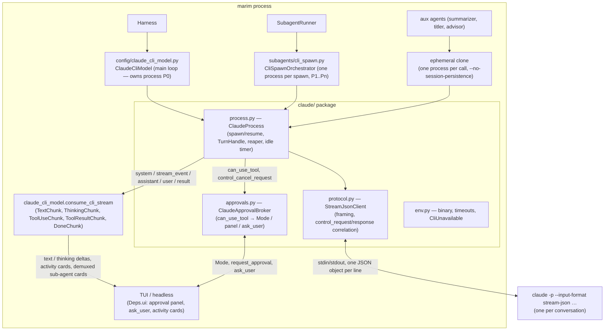

# Claude Code CLI as a bidirectional provider and sub-agent backend — Design

Date: 2026-09-05
Branch: `feat/claude-cli-bidi` (off master at e96b66a4, after the codex-cli merge)
Status: approved 2026-09-05 (design reviewed in chat) — implementation pending
Closes: Gitea #109

## Goal

Port the `claude-cli` pair onto the same bidirectional approach the
`codex-cli` pair uses, so a Claude Code session driven by marim keeps
**marim's approval gating in the loop**:

1. **Main-loop provider** — `MARIM_PROVIDER=claude-cli` runs one long-lived
   `claude` process per session over `stream-json` stdin/stdout. Claude asks
   marim before every tool call it would otherwise prompt for, and marim
   answers from its live `Mode` (`auto`/`ask`/`plan`) and its existing
   approval panel. `ask_user`, steer and interrupt all work; the Claude
   session id is persisted so a restarted marim resumes the same Claude
   conversation.
2. **Sub-agent backend** — `backend: claude-cli` spawns run the same way, each
   in its own process, with the parent's mode brokering their tool calls and
   their prompts rendered in the parent's approval panel prefixed with the
   spawn name.

The one-shot `claude -p` launch, the `--permission-mode` mapping (`_MODE_MAP`)
and the "ask mode degrades to plan" limitation are removed. There is one
design for both front doors, not a one-shot/bidi split.

## Background

### What exists: the `claude-cli` pair

- `config/claude_cli_model.py` — `ClaudeCliModel(ExternalCliModel)`: spawns
  `claude -p --output-format stream-json` **once per turn**
  (`spawn_cli_objects`), folds the stream into a **text-only** `ModelResponse`
  (`consume_cli_stream` → `TextChunk`/`ToolUseChunk`/`ToolResultChunk`/
  `DoneChunk`; tool activity reaches the TUI through `on_activity` and the
  shared `TextFolder`, never as tool parts in marim's history), and tees the
  stream through `CliSubagentDemux` so Claude's own Agent/Task sub-agents
  render as nested cards. Permission is fixed up front: `permission_mode_for`
  maps `auto` → `acceptEdits` and `ask`/`plan` → `plan`, and
  `note_ask_limitation_once` warns that ask mode cannot prompt. `session_id`
  lives in memory only; `ephemeral_clone` returns a plan-mode copy used by
  the aux agents (summarizer, titler, advisor).
- `subagents/cli_backend.py` + `cli_spawn.py` + `cli_demux.py` — the spawn
  side: `build_cli_argv`, `map_tools_to_cc`, `cli_permission_mode`,
  `CliStreamTranslator` (whole `assistant`/`user` objects → transcript
  messages), `ClaudeCliRunner.run` (one-shot spawn with a wall-clock deadline
  and a checkpoint callback), and `CliSpawnOrchestrator.execute/resume`
  producing the backend-agnostic `SpawnRun`. An interrupted spawn resumes by
  launching `claude -p --resume <id>` with the id from the sidecar meta key
  `cli_session_id`.
- `config/external_cli.py` — `ExternalCliModel`, the base both CLI models
  share, with the late-bound seams `Harness.wire_cli_model` fills:
  `mode_getter`, `cwd`, `on_activity`, `on_subagent`, `on_subagent_model`,
  `request_approval`, `ask_user`, `scratchpad_getter`, `thinking_getter`,
  `session_ref_getter`, `on_session_ref`, plus `steer()` (default `False`),
  `compact_remote()` (default no-op) and `ephemeral_clone()`. The codex
  work introduced `SessionStore.cli_thread_id` (`"<provider>:<id>"`, nulled
  by `SessionController.set_model` on a provider switch) and the
  `codex/approvals.decide` policy table this design generalizes.

### What Claude Code offers (verified live against claude 2.1.261)

Eight throwaway probe scripts (scratchpad only, not in the repo) drove a real
`claude` process over
`-p --input-format stream-json --output-format stream-json --verbose
--permission-prompts host --permission-prompt-tool stdio
--include-partial-messages --replay-user-messages`. Every shape below is
copied from the captured logs.

**Control envelope.** Host → CLI:
`{"type":"control_request","request_id":"<any string>","request":{"subtype":…}}`.
CLI → host:
`{"type":"control_response","response":{"subtype":"success"|"error","request_id":"<same>","response":{…}}}`.
`request_id` is the only correlation; the host picks it.

| Subtype (host → CLI) | Response | Notes |
|---|---|---|
| `initialize` `{"hooks":{}}` | `commands, agents, models[], account{email,subscriptionType,apiProvider}, pid, current_permission_mode, session_state:"idle", …` | Optional; a user message works without it. |
| `set_permission_mode` `{"mode":"plan"}` | `{"mode":"plan"}` | Accepted mid-session. **Not used** (see mapping). |
| `set_model` `{"model":"haiku"}` | success, no `response` body | Accepted. **Not used** in v1 (a model change rebuilds the model). |
| `interrupt` | `{"still_queued":[]}` | See below. |

**User input.** `{"type":"user","message":{"role":"user","content":[{"type":"text","text":…}]}}`
on stdin. Under `--replay-user-messages` it is echoed back with
`"isReplay": true`. A second user message **while a turn is live is injected
into that turn** (Claude acknowledged it mid-turn; one `result`,
`queued_turn_count: 0`) — not queued as a separate turn, not rejected. That is
exactly steer.

**Session bootstrap.** `{"type":"system","subtype":"init", cwd, session_id,
tools[], mcp_servers[], model, permissionMode, slash_commands[], agents[],
skills[], plugins[], capabilities:["interrupt_receipt_v1",
"interrupt_cancel_queued_v1","msg_lifecycle_v1"], memory_paths, claude_code_version, …}`
is emitted **after the first user message**, not on `initialize`. Other
`system` subtypes seen: `status` (`"requesting"`), `thinking_tokens`.

**Streaming.** With `--include-partial-messages` every model message arrives
twice: as `stream_event` objects (`message_start`, `content_block_start`
{`text`|`thinking`|`tool_use`}, `content_block_delta` with `text_delta` /
`thinking_delta` / `signature_delta` / `input_json_delta`,
`content_block_stop`, `message_delta` with `stop_reason` + `usage`,
`message_stop`) and then as the whole `assistant` message. Each object carries
`session_id` and `parent_tool_use_id` (`null` on the main conversation,
the parent `tool_use` id inside an Agent/Task sub-agent). Tool results come
back as `user` objects whose content is a `tool_result` block.

**Permission brokering.** `--permission-prompts host` alone auto-denies with
the tool_result *"Claude requested permissions to write to …, but you haven't
granted it yet"*; **`--permission-prompt-tool stdio` is what routes prompts to
stdin**. Then the CLI sends
`{"type":"control_request","request_id":"<uuid>","request":{"subtype":"can_use_tool","tool_name":"Write","display_name":"Write","input":{"file_path":…,"content":…},"description":"note.txt","permission_suggestions":[{"type":"setMode","mode":"acceptEdits","destination":"session"}],"tool_use_id":"toolu_…"}}`
and waits. Answers (host → CLI, wrapped in the `control_response` envelope
above, `subtype: "success"`):

| `response` | Effect |
|---|---|
| `{"behavior":"allow","updatedInput":{…}}` | Runs the tool with `updatedInput` (verified: rewritten `content` was what got written). |
| `{"behavior":"deny","message":"…"}` | tool_result `is_error: true` carrying the message **verbatim**; the call is listed in `result.permission_denials[{tool_name,tool_use_id,tool_input}]`. |

In `default` permission mode the CLI only asks for what it would prompt a
human for: reads inside `cwd` and built-in safe commands (`echo`, `ls`, …)
never arrive.

**AskUserQuestion.** Exists as a tool only under `--permission-prompt-tool
stdio`. It arrives as `can_use_tool` with `"requires_user_interaction": true`
and input `{"questions":[{"question","header","options":[{"label","description"}],"multiSelect"}]}`.
Answer = allow with `updatedInput` = the input plus
`"answers": {"<question text>": "<label>"}` → tool_result *"Your questions
have been answered: "Which color do you prefer?"="Blue"."* and
`tool_use_result.answers`.

**Interrupt.** `{"subtype":"interrupt"}` → `{"still_queued":[]}`. With a
`can_use_tool` pending the CLI first emits
`{"type":"control_cancel_request","request_id":"<that request's id>"}`, then a
tool_result *"The user doesn't want to proceed with this tool use … STOP"*, a
user text `[Request interrupted by user for tool use]`, and
`result {"subtype":"error_during_execution","is_error":true,"result":null,"terminal_reason":"aborted_tools","stop_reason":"tool_use"}`.
Mid-stream with no prompt pending: `terminal_reason: "aborted_streaming"`.
Interrupting an idle process is a harmless success. **The process survives**
and answers the next user message normally.

**Turn end.** `{"type":"result", subtype:"success"|"error_during_execution"|…,
is_error, result, num_turns, session_id, stop_reason, terminal_reason
("completed"|"aborted_tools"|"aborted_streaming"), total_cost_usd,
usage{input_tokens,cache_creation_input_tokens,cache_read_input_tokens,output_tokens,…},
modelUsage{…}, permission_denials[], queued_turn_count, duration_ms}` — one
per user turn.

**Resume.** `--resume <session_id>` on a fresh process works from the same or
a different `cwd` and keeps the id; `--session-id` is not needed. An unknown
id: stderr `No conversation found with session ID: …`, result
`error_during_execution` with `num_turns: 0`, exit code 1.

**Isolation flags.** `--strict-mcp-config` → `mcp_servers: []`.
`--setting-sources ""` still lists the user's 17 skills, 52 slash commands and
5 agents. `--safe-mode` (sets `CLAUDE_CODE_SAFE_MODE=1`) drops `memory_paths`
(auto-memory) and plugin hooks, keeps auth, still lists skills. `--tools A,B`
and `--disallowedTools A,B` trim `tools` in `system/init` as expected.
`--no-session-persistence` works (turn completes, nothing written under
`~/.claude/projects`). **`--bare` breaks subscription auth** ("Not logged in ·
Please run /login") and is unusable. `--permission-mode plan` makes the CLI
write plan files to `~/.claude/plans` and demand `ExitPlanMode` before any
edit — a UI flow marim does not want, so marim never puts the CLI in plan mode.

### Why bidirectional over one-shot

`claude -p` per turn cannot talk back: permission has to be fixed up front,
so `ask` mode silently degraded to read-only and `plan` was the only safe
default, `ask_user` could not exist, steer had to wait for the next turn,
Ctrl-C was a process kill, and every turn paid a cold process start. The
stream-json control protocol gives the host every request a human would see,
so marim's `Mode`, panel and `ask_user` apply unchanged. The cost is one
line-protocol client and a per-conversation process supervisor, both of which
have a direct template in `codex/rpc.py` and `codex/server.py`.

## Architecture



**One process per conversation.** The main-loop model owns one process for
the session, started lazily on the first turn and kept alive across turns;
each `backend: claude-cli` spawn owns one for the spawn's lifetime; each
ephemeral aux call owns one for that call. There is no shared server, no
singleton and no registry: Claude Code hosts exactly one conversation per
process, so the codex "threads on one server" topology has nothing to
multiplex. `Harness.aclose` and a model swap close the main-loop process; the
spawn and clone paths close theirs when their run ends.

### New package: `src/marim_harness/claude/`

| Module | Responsibility | Depends on |
|---|---|---|
| `protocol.py` | `StreamJsonClient`: newline-delimited JSON over an asyncio stdin writer / stdout reader (`marim_harness.ndjson`, never via `subagents.cli_backend`). Outbound `control(subtype, **fields) -> dict` mints a uuid `request_id`, writes the envelope and awaits the matching `control_response` (an `error` subtype raises `ControlError(message)`); outbound `user(text)` writes a user message; inbound objects are routed by `type`: `control_response` completes a future, `control_request` goes to the request handler (which answers through `respond(request_id, response)`), `control_cancel_request` goes to the cancel handler, everything else to the event handler. EOF completes every pending future with `ProcessClosed` and publishes a CLOSED pseudo-event. Pure protocol; no Claude Code knowledge beyond the envelope. | asyncio, `ndjson` |
| `process.py` | `ClaudeProcess`: builds the argv from `ProcessOptions` (binary, model, cwd, resume id, tools/disallowed tools, appended system prompt, persist flag, env), spawns in its own process group, runs the reader task, pumps stderr into a bounded tail, exposes `send_turn(text) -> TurnHandle`, `send_user(text)` (steer), `interrupt(handle)`, `aclose()`, `alive`, `session_id`, `last_stderr`. Routes every non-control object to the **open** turn's queue; `result` closes the turn. Owns the idle timer (main loop only) and the reaper (`_reap`: waits on the child, marks it dead, fails the open turn with `TurnFailure`). | `protocol.py`, `env.py`, `tools.impl.process.kill_process_tree` |
| `approvals.py` | `ClaudeApprovalBroker`: answers `can_use_tool`. `classify(tool_name, input) -> ToolRequest(mutating, paths, question)` is pure and table-driven; the broker feeds it to the shared policy core (`runtime/permissions.decide_external`), then either responds directly, prompts through `request_approval(ToolCallPart)`, or routes an `AskUserQuestion` through `ask_user`. Serializes prompts with a lock (one panel at a time, arrival order). Handles `control_cancel_request` by dismissing the pending prompt. | `runtime/permissions`, `pydantic_ai.messages`, `Question/Choice` |
| `env.py` | `CLI_BINARY_ENV`, `CLI_MODEL_ENV`, `CLI_TIMEOUT_ENV`, new `CLI_IDLE_TIMEOUT_ENV`, `resolve_cli_binary`, `cli_timeout`, `cli_idle_timeout`, `CliUnavailable`, `MIN_CLAUDE_VERSION = "2.1"`. Moved out of `subagents/cli_backend.py` so `claude/` never imports the sub-agent layer (the cycle the ndjson rule exists for); `cli_backend` re-exports the names. | nothing |

The two front doors stay where they are, as with codex:
`config/claude_cli_model.py` (`ClaudeCliModel`) and `subagents/cli_spawn.py`
(`CliSpawnOrchestrator`). `subagents/cli_backend.py` keeps
`map_tools_to_cc`, `normalize_cc_tool`, `CliStreamTranslator`,
`synth_usage`, `sum_result_usages`, `CliResult`; it loses the one-shot runner
plumbing (`ClaudeCliRunner.run`'s spawn/deadline loop, `_RunState`,
`_read_next_line`, `_POST_LOOP_GRACE`, `cli_permission_mode`, the
`permission_mode` argument of `build_cli_argv`), which `ClaudeProcess`
replaces. `cli_demux.py` is untouched.

### Stream object → marim chunk table

`consume_cli_stream` stays the single translation layer (its chunk
vocabulary is what `ClaudeCliStreamedResponse`, `fold_chunk_text`,
`cli_activity_events` and the tests already speak); it now reads a turn's
event queue instead of a one-shot pipe and learns the delta shapes.

| Stream object | marim side |
|---|---|
| `system/init` | `session_id` → `on_session_ref("claude-cli:<id>")`; `claude_code_version` below `MIN_CLAUDE_VERSION` → one `Notice`; otherwise ignored |
| `stream_event` `content_block_delta.text_delta` (main conversation, `parent_tool_use_id` null) | `TextChunk` delta → `TextPart` start/delta |
| `stream_event` `content_block_delta.thinking_delta` | new `ThinkingChunk` → `ThinkingPart` start/delta (empty deltas — redacted thinking — are skipped) |
| other `stream_event` types (`message_start`, `*_stop`, `signature_delta`, `input_json_delta`, `message_delta`) | ignored |
| `stream_event` with `parent_tool_use_id` set | dropped (child streams render from their whole messages through the demux, as today) |
| `assistant` message `tool_use` block | `ToolUseChunk` → activity card via `on_activity` (`cli_activity_events`, `normalize_cc_tool`); **text/thinking blocks are ignored** because the deltas already carried them |
| `user` message `tool_result` block (not `isReplay`) | `ToolResultChunk` → activity end / fold |
| `user` message with `isReplay: true` | dropped (echo of marim's own input or steer) |
| `system/status`, `system/thinking_tokens` | ignored |
| `result` | `DoneChunk`: `usage` → `RequestUsage` via `request_usage_from_cli`; `is_error` with `terminal_reason ∈ {aborted_tools, aborted_streaming}` → a normal, interrupted end; any other `is_error` → `CliModelError(result or last stderr)` |
| CLOSED pseudo-event (process died) | `CliModelError("claude exited (code N): <stderr tail>")` |

Spawn transcripts keep using `CliStreamTranslator.translate(obj)` on the
whole `assistant`/`user` objects (unchanged), so the sidecar transcript is
the same shape it is today; the spawn simply ignores `stream_event`s.

### Shared policy core

`codex/approvals.decide(mode, method, params, workspace_root, scratchpad)`
becomes a thin adapter over a transport-neutral function in
`runtime/permissions.py`:

```python
@dataclass(frozen=True)
class ExternalRequest:
    mutating: bool          # would change files, run commands, or reach the network
    paths: tuple[Path, ...] # file paths the request names, when known

def decide_external(mode, req, workspace_root, scratchpad) -> Decision
```

`Decision(accept, reason, ask)` moves alongside it (codex keeps re-exporting
it). The table is the one codex already has, stated once:

| `Mode` | non-mutating | mutating inside workspace ∪ scratchpad | mutating outside | mutating, paths unknown (e.g. Bash) |
|---|---|---|---|---|
| `plan` | accept | deny `"plan mode: read-only — describe the change instead of making it"` | deny (same) | deny (same) |
| `auto` | accept | accept | **ask** (`"outside workspace: <path>"`) | accept |
| `ask` | accept | scratchpad-only → accept (`"scratchpad write"`); otherwise **ask** | ask | ask |

`ask` means "prompt if a `request_approval` seam is bound"; with no seam
(headless, spawn without UI) the answer is **accept** — the same headless
default codex uses, and the one `SubagentRunner` already relies on for
codex spawns. A prompt dismissed by interrupt is a deny with
`"cancelled by user"`.

## Data flow: one main-loop turn

1. `Harness.run_turn` → Pydantic AI calls `ClaudeCliModel.request_stream`.
2. `_ensure_process()`: if the model holds a live process, use it. Otherwise
   build `ProcessOptions` from `cwd`, the model name, the isolation argv, and
   `session_ref_getter()`: a stored `"claude-cli:<id>"` becomes
   `--resume <id>`; anything else (no ref, foreign prefix) starts fresh.
   Start the process, send `initialize` (logged, not gated), install the
   broker as the request handler.
3. Input: when the process resumed a stored session, send
   `latest_user_text(messages)`; when it is fresh but marim's history is not
   (provider switch, lost session), send `flatten_history(messages)` as the
   first input — the same recovery the one-shot adapter used.
   `extract_system(messages)` goes to `--append-system-prompt` as today, so
   Claude Code's own base prompt stays intact.
4. `handle = process.send_turn(text)` — the handle (and its queue) exists
   **before** the bytes hit stdin, and every later step keys on that handle,
   never on `process.current_turn` (the 3.10 CI leg orders completion before
   the send call returns).
5. `consume_cli_stream(handle.events())` yields chunks; text and thinking
   deltas become `PartStartEvent`/`PartDeltaEvent`, tool chunks go to
   `on_activity` through the shared `TextFolder`, sub-agent objects are teed
   through `CliSubagentDemux` as today. Meanwhile `can_use_tool` requests
   reach the broker, which awaits the panel and answers on the wire; the
   stream stays open (the per-turn silence clock pauses while a prompt is
   open).
6. `result` closes the turn: `usage` → `RequestUsage` (cost zero;
   tokens land in the stats ledger as today); the idle timer is re-armed.
7. The final `ModelResponse` is **text only** (`TextPart`, optional
   `ThinkingPart`) — the invariant that keeps marim's history portable across
   providers and resumable.

**Steer.** `Harness.steer` → `ClaudeCliModel.steer(text)`: with a turn open
it writes a `user` message on stdin and returns `True` (Claude folds it into
the live turn); with no turn open it returns `False` and the harness queues a
normal turn, as today.

**Interrupt.** Cancelling `request_stream` (Ctrl-C / `_flush_resumable`)
runs `process.interrupt(handle)` in the `finally`: send `interrupt`, let the
broker fail any pending prompt (the CLI's `control_cancel_request` arrives
first), then wait up to a 2 s grace for the turn's `result`; if it does not
come, kill the process group (the next turn resumes by id). An aborted
`result` is not an error — the streamed response ends with whatever text
arrived.

**Model change.** Switching to another `claude-cli:` model rebuilds the
model object as today; the harness's model-swap path now awaits `aclose()`
on the outgoing `ExternalCliModel`, and the new one resumes the same session
with the new `--model`. `set_model` over stdin is deliberately unused in v1.

## Mode → approval mapping

The CLI always runs in **`default` permission mode**. marim never sends
`set_permission_mode`, never honors `permission_suggestions`, and never uses
the CLI's own `plan`/`acceptEdits`/`bypassPermissions` modes: marim's `Mode`
is the single policy source, applied per request through the shared table
above, and `/mode` takes effect at the next request without a rebuild
(`mode_getter` is read per request, as with codex). In `default` mode the CLI
auto-allows reads inside `cwd` and its built-in safe commands, which is the
"allow reads" half of the table for free; everything else is a `can_use_tool`.

`classify(tool_name, input)`:

| Tool | `mutating` | `paths` |
|---|---|---|
| `Read`, `Glob`, `Grep`, `LS`, `WebFetch`, `WebSearch`, `TodoRead`, `TaskGet`, `TaskList`, `ListAgents`, `ToolSearch` | no | — |
| `Write`, `Edit`, `MultiEdit`, `NotebookEdit` | yes | `file_path` / `notebook_path` |
| `Bash`, `Task`, `Agent`, `Skill`, `Workflow`, `Cron*`, `SendMessage`, `ScheduleWakeup`, `Enter/ExitWorktree` | yes | — |
| `mcp__*` | yes unless the CLI marks it read-only (`annotations.readOnlyHint`) | — |
| unknown | yes | — |
| `AskUserQuestion` (`requires_user_interaction`) | question — never a policy decision | — |

Prompted requests render through the existing `ApprovalPanel(tool_name,
args)` as a `ToolCallPart` whose name is the normalized marim tool
(`normalize_cc_tool`: `Bash` → `bash`, `Write`/`Edit` → `write_file`/
`edit_file`, MCP names verbatim) and whose args are the CLI `input`, so the
panel shows a Claude `Write` exactly like marim's own `write_file`. Approve →
`allow` with `updatedInput` = the original input (unchanged); deny → `deny`
with the panel's reason or marim's table reason. Deny messages are written
for Claude: they say what was refused and what to do instead, because they
land verbatim in its tool_result.

`AskUserQuestion` → `[Question(text=q["question"], header=q["header"],
choices=[Choice(label, description)], multi=q["multiSelect"])]` →
`ask_user` → `allow` with `updatedInput.answers = {question: label}`.
`ask_user` unbound or the user cancels → `deny` with
`"the user is not available to answer; proceed on your best judgement and
say what you assumed"`.

Removed: `_MODE_MAP`, `permission_mode_for`, `note_ask_limitation_once`,
`cli_permission_mode`, the `--permission-mode` flag and every doc sentence
that says ask mode degrades to plan.

## Thinking level

Unchanged and still documented as a no-op under the `claude-cli` main
provider: `ModelSettings` never reach Claude Code, and the CLI's effort
switch is not wired in v1. `thinking_getter` stays bound for parity and is
unused.

## Model naming and catalog

Unchanged: slugs are `claude-cli:<model>`; `MARIM_CLAUDE_CLI_MODEL` applies
to spawns only; the static alias list in the picker stays. The `initialize`
response's `models` and `account` fields are logged at DEBUG and not used.

## Isolation from the user's Claude Code config

Every marim-started process gets:

```
--strict-mcp-config --setting-sources "" --safe-mode
--permission-prompts host --permission-prompt-tool stdio
--input-format stream-json --output-format stream-json --verbose
--include-partial-messages --replay-user-messages
```

plus `--model`, `--append-system-prompt`, `--resume <id>` when resuming,
`--no-session-persistence` for ephemeral clones, and for spawns `--tools`
(from `map_tools_to_cc`, unchanged) and `--disallowedTools Task,Agent` at
the depth ceiling (unchanged). The env strips `CLAUDE_CODE_SSE_PORT`,
`CLAUDECODE` and `CLAUDE_CODE_ENTRYPOINT` so a marim launched from inside
Claude Code does not confuse the child.

What that isolates: MCP servers (none load), plugin hooks and auto-memory
writes (`--safe-mode`), marim's approval policy (no CLI-side session grants
ever accumulate). What it does not: the user's skills, slash commands and
agents remain listed, and `CLAUDE.md`/memory files remain *readable* — the
same residual the codex spec documents for skills. `--bare` would remove
them but breaks subscription auth, so it is rejected, and this residual is
stated in the configuration reference.

## Sub-agent backend

`CliSpawnOrchestrator` keeps its shape (`execute`/`resume` → `SpawnRun`,
rejoining `SubagentRunner._run_spawn_lifecycle`); `ClaudeCliRunner.run`
becomes a bidi run:

- `execute(defn, task, …)`: create a `ClaudeProcess` (cwd = worktree when
  isolated, `--tools` from the spec, `--append-system-prompt` from the spec
  body, model precedence unchanged), install a `ClaudeApprovalBroker` with
  `mode_getter` = the parent's live mode, the parent's `request_approval`/
  `ask_user` seams and `label = defn.name` (prompts render in the parent's
  panel prefixed with the spawn name, exactly as codex spawns do; a
  background spawn that needs approval waits on the panel like a native
  background spawn), `send_turn(task)`, translate whole objects through
  `CliStreamTranslator` + `CliSubagentDemux` with the same checkpoint
  callback as today, then `aclose()` the process. Meta gains nothing new:
  `cli_session_id` keeps its meaning (the Claude session uuid, now captured
  from `system/init` at turn start rather than from `result`), so old
  sidecars resume unchanged and no migration is needed.
- `resume(stream_id, meta)`: `ClaudeProcess(resume_id=meta["cli_session_id"])`
  + `send_turn(CONTINUATION_PROMPT)`; a `No conversation found` failure
  falls back to a fresh process with the persisted transcript flattened, as
  today.
- Tool reach is still decided by `--tools`; `plan` and `ask` correctness now
  come from the broker instead of from `cli_permission_mode`. Headless spawns
  (no seams) get the headless default (accept in `ask`, deny mutating in
  `plan`).
- `MARIM_CLAUDE_CLI_TIMEOUT` keeps bounding one spawn, now as the silence
  ceiling of its single turn (see supervisor); on expiry the runner interrupts
  and then kills, and the spawn finalizes as a timeout with partial output, as
  today.

## Supervisor and error handling

- **Startup.** `CliUnavailable` (binary missing) surfaces as the
  provider-unavailable path in `build_model` / the spawn notice with the
  install hint, as today. A CLI that rejects the argv (too old for
  `--permission-prompt-tool stdio`) exits before `system/init`; the first
  turn fails with `CliModelError` carrying the stderr tail and the version
  hint (`MIN_CLAUDE_VERSION`).
- **Resume failure.** A `--resume` process that dies on the first turn with
  `No conversation found` in stderr is retried **once** without `--resume`,
  first input = `flatten_history(messages)`, with a `Notice` ("previous
  Claude session not found; continued from marim's history"); the stale ref
  is overwritten by the new `system/init`. Any other first-turn death is an
  error.
- **Death mid-turn** (EOF / exit): the open turn fails with `CliModelError`
  and the last stderr lines; `_actionable_error_note` treats it as infra (no
  note to the model). The model drops the dead process; the **next turn
  respawns with `--resume <id>`** so the conversation continues. The spawn
  path finalizes the spawn as failed (no auto-respawn inside a spawn).
- **Silence timeout.** `MARIM_CLAUDE_CLI_TIMEOUT` (default 600 s) bounds the
  silence between stream objects while a turn is open, **excluding time a
  prompt is open in the panel** (a human answering in `ask` mode is not
  silence). On expiry: `interrupt`, 2 s grace, kill.
- **Idle reaping.** New `MARIM_CLAUDE_CLI_IDLE_TIMEOUT` (default 600 s, `0`
  = never): a main-loop process with no open turn for that long is closed;
  the next turn resumes it by id. Spawn and clone processes never idle (they
  close at run end). Rationale: an idle `claude` is a ~200 MB node process
  and resume is transparent.
- **Interrupt.** As in the data flow; the broker dismisses a pending prompt
  on `control_cancel_request` even when the interrupt did not come from
  marim (the CLI may cancel on its own).
- **Shutdown.** `ExternalCliModel.aclose()` becomes part of the base
  (default no-op; codex keeps its implementation); `Harness.aclose` and the
  model-swap path call it on whatever `ExternalCliModel` is current instead
  of the `CodexCliModel` `isinstance` they have today. `aclose` on
  `ClaudeCliModel`: close stdin, SIGTERM the group, SIGKILL after a short
  grace (`kill_process_tree`).
- **Ephemeral clones.** `ephemeral_clone(cwd)` returns a `ClaudeCliModel`
  with `mode_getter = plan`, no UI seams, no session ref seams and
  `--no-session-persistence`; each `request` spawns, runs one turn, and
  closes the process in `finally`. Read-only and unresumable by
  construction, so the summarizer/titler/advisor can never touch the
  session's process or the workspace.

## Session persistence

`SessionStore.cli_thread_id` now carries `"claude-cli:<session uuid>"` for
this provider, written through `on_session_ref` when `system/init` arrives
and read through `session_ref_getter` when a process starts. The existing
rules apply unchanged: `SessionController.set_model` nulls a ref whose prefix
does not match the new provider; new sessions do not inherit it; clones never
write it. marim's own history remains the source of truth — a lost Claude
session degrades to "fresh process, flattened history", never to a lost
conversation. Compaction: marim compacts its own history as today and keeps
the Claude session; `compact_remote()` stays a no-op (Claude Code
auto-compacts on its own).

## Testing

- **Fake `claude`** (`tests/fakes/fake_claude.py`, exposed as
  `tests.fakes.fake_claude_bin(tmp_path, scenario)` like `fake_codex_bin`): a
  Python script speaking the verified vocabulary over stdio — answers
  `initialize`, emits `system/init` on the first user message with a fixed
  `session_id`, streams `stream_event` deltas followed by whole `assistant`
  messages, issues `can_use_tool` (with and without
  `requires_user_interaction`), honors `deny` by emitting the error
  tool_result and listing `permission_denials`, honors `interrupt` with
  `control_cancel_request` + an aborted `result`, folds a mid-turn `user`
  message into the live turn, honors `--resume` (known id continues, unknown
  id prints `No conversation found` and exits 1), records every argv and
  inbound object to a JSONL log (`read_request_log`). Scenarios: `text`,
  `write_prompt`, `ask_user`, `interrupt`, `steer`, `die_mid_turn`,
  `resume_unknown`, `subagent` (a `parent_tool_use_id` stream for the
  demux).
- **Unit.** `protocol.py` (framing, `request_id` correlation, error
  responses, cancel routing, EOF failing futures); `decide_external` mode ×
  request matrix including outside-workspace and scratchpad rules, with the
  codex adapter's existing tests unchanged; `classify` per tool including
  MCP read-only annotations and unknown tools; `consume_cli_stream` on
  captured fixtures (text/thinking deltas, tool_use cards, replays dropped,
  child streams dropped, aborted vs failed `result`); broker answers
  (allow/deny/ask_user shapes, headless defaults, cancel).
- **Model.** `ClaudeCliModel` against the fake: lazy start, process reuse
  across turns, `--resume` from a stored ref, unknown-id fallback with
  flattened history + `Notice`, `latest_user_text` vs `flatten_history`
  input choice, streamed text/thinking, brokered `Write` in `ask` mode going
  through `request_approval`, `plan` denial text reaching the fake, steer
  while live, interrupt mid-stream (aborted result → clean end), death
  mid-turn → `CliModelError` then respawn on the next turn, idle reaper
  closing and the next turn resuming, `aclose` killing the group, text-only
  response invariant, usage folding, ephemeral clone using
  `--no-session-persistence` and closing after one request.
- **Spawn.** `execute`/`resume` meta and `SpawnRun` shape, brokered prompt
  routed to the parent's panel with the spawn label, headless spawn defaults,
  silence timeout → interrupt + kill + partial output, runner dispatch on
  `backend: claude-cli` and resume from `cli_session_id`, demuxed child
  cards.
- **Harness.** `aclose` and model swap close an `ExternalCliModel`;
  `Harness.steer` prefers `model.steer`; `wire_cli_model` binds the seams.
- **Live smoke** (`tests/test_claude_cli_live.py`, gated on
  `MARIM_LIVE_CLAUDE=1`, skipped in CI, run only with the user's explicit OK
  because it spends subscription quota): one main-loop turn on `haiku` with a
  brokered `Write` allowed and one denied, an `AskUserQuestion` answered, an
  interrupt mid-turn, a resume on a fresh process, and one spawn.
- **Docs test.** `MARIM_CLAUDE_CLI_IDLE_TIMEOUT` is documented in
  `docs/reference/configuration.md` so `test_every_env_var_is_documented`
  stays green.
- **Quality gate.** New modules ship with coverage at or above the baseline;
  `C901 ≤ 10` by keeping dispatch tables for object routing and tool
  classification; no edits to `quality-baseline.json`, `quality-gate.toml`
  or `.gitleaks.toml`.

## Out of scope (v1)

- `set_model` / `set_permission_mode` over stdin; the CLI's effort switch.
- Forwarding marim's MCP grants into the Claude process (the `_mcp_note`
  mechanism keeps telling the model they are unavailable).
- Honoring `permission_suggestions` (session-wide grants would outlive a
  `/mode` switch).
- Attachments (images) on the main-loop turn; `Harness.steer` with
  attachments keeps falling back to a queued turn.
- Hiding the user's skills, slash commands and agents from the child.
- `--fork-session` and Claude Code's own plan-mode UI.

## Decisions log

- **One process per conversation, no singleton**: Claude Code hosts one
  conversation per process, so a shared server would only add a registry with
  nothing to multiplex; the brief asked for a per-session supervisor.
- **CLI stays in `default` permission mode; marim brokers everything**: one
  policy source, `/mode` wins instantly, and the CLI's own `plan` UI
  (plan files, `ExitPlanMode`) never appears. `acceptEdits` in `auto` was
  rejected because it would skip the outside-workspace check.
- **Shared policy core in `runtime/permissions.py`**: the codex table is the
  right one; stating it once and adapting request shapes on each side keeps
  the two CLI backends from drifting.
- **Headless `ask` = deny**, matching codex, so the two backends behave the
  same in headless and in background spawns: with no approver bound there is
  nothing that could grant approval, so anything needing a prompt is refused
  (with wording that tells the model to say what it would have done). An
  unattended run that must write needs `--mode auto`.
- **Deltas for text, whole messages for tools and transcripts**: the model
  streams from `stream_event`s and ignores `assistant` text; spawns keep
  `CliStreamTranslator` on whole objects, so `cli_demux.py` and the sidecar
  transcript shape are untouched.
- **Idle reaper with `MARIM_CLAUDE_CLI_IDLE_TIMEOUT` (600 s)**: resume makes
  respawn invisible, and an idle node process is not free.
- **`cli_session_id` stays** as the spawn sidecar key (same meaning), so no
  sidecar migration; the main loop persists through `cli_thread_id` with the
  `claude-cli:` prefix like codex.
- **`--safe-mode` + `--strict-mcp-config` + `--setting-sources ""`, not
  `--bare`**: `--bare` breaks subscription auth; skills remain a documented
  residual as with codex.
- **Text-only responses** kept; **`ExternalCliModel.aclose()`** promoted to
  the base so the harness closes whichever CLI model is current without
  `isinstance` per provider.
